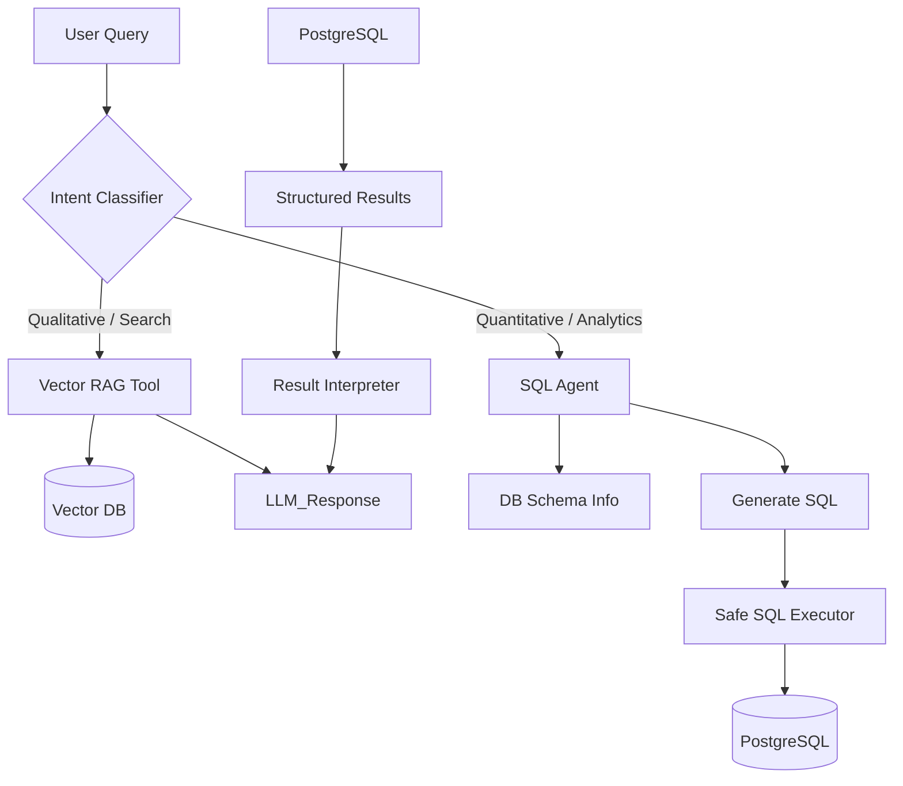

# Business Intelligence Enhancement Plan for DocIntelRAG

## 1. Problem Analysis
The current system uses **Standard RAG** (Retrieval-Augmented Generation), which retrieves text chunks based on semantic similarity.
- **Strengths:** Excellent for finding specific clauses, descriptions, or qualitative information ("What is the payment term for Invoice X?").
- **Weaknesses:** Fails at **aggregation**, **counting**, **math**, and **global filtering** ("How much did I spend in January?", "Who are the top 3 suppliers?", "Count all invoices from 2024").

Semantic vector search cannot perform mathematical operations or precise database filtering. To solve this, we need to introduce **Structured Data Querying (Text-to-SQL)** capabilities.

## 2. Proposed Architecture: Agentic RAG
We will move from a linear RAG pipeline to a **Router/Agent Architecture**.

### Key Components:
1.  **Intent Router:** A lightweight prompt to decide if the user wants to *search text* or *analyze data*.
2.  **SQL Agent:** A specialized chain that knows the database schema (specifically tables `documents` and `extracted_fields`) and can generate valid SQL queries.
3.  **Read-Only Database User:** For security, the SQL Agent will use a restricted DB user with `SELECT` only privileges.

## 3. Implementation Plan

### Phase 1: Data Preparation & Security
*Objective: Make the database "LLM-friendly" and secure.*
- [ ] **Create Reporting View:** Create a simplified SQL View (`v_reporting_data`) that joins `documents` and `extracted_fields` into a flat, easy-to-query structure (e.g., columns: `doc_date`, `supplier_name`, `total_amount`, `currency`, `doc_type`).
- [ ] **Create Read-Only DB User:** Configure a PostgreSQL user with read-only access to this view.

### Phase 2: The SQL Agent (Backend)
*Objective: Enable the backend to translate questions into SQL.*
- [ ] **Schema Definition:** Define a Pydantic model or text description of the `v_reporting_data` view to pass to the LLM.
- [ ] **SQL Generation Chain:** Implement a function `generate_sql(question: str) -> str` using the LLM (DeepSeek-Coder or similar).
- [ ] **Query Executor:** Implement `execute_sql(query: str)` using the read-only connection.
- [ ] **Response Synthesizer:** Implement `explain_results(question: str, results: list) -> str` where the LLM converts SQL rows into a natural language answser.

### Phase 3: The Router & Chat Integration
*Objective: Seamlessly switch between RAG and BI.*
- [ ] **Update Chat Endpoint:** Modify `/chat` API to classify intent.
- [ ] **Integrate Tools:** If intent is BI, call SQL Agent; else call existing RAG.
- [ ] **UI Updates:** Enhance frontend to render tables/charts if the response contains structured data (Optional/Future).

## 4. Testing Plan & Acceptance Conditions

### Test Case A: Aggregations (The "Math" Test)
- **Question:** "Quanto ho speso in totale nel 2024?" or "Qual è la somma delle fatture di gennaio?"
- **Condition:** The system executes `SELECT SUM(amount) ...` and returns a specific number, not a vague text summary.

### Test Case B: Ranking & Top-K (The "Strategy" Test)
- **Question:** "Chi sono i primi 3 fornitori per spesa?"
- **Condition:** The system executes `SELECT supplier, SUM(amount) ... GROUP BY ... ORDER BY ... LIMIT 3`.

### Test Case C: Counting (The "Volume" Test)
- **Question:** "Quante fatture ho ricevuto da 'TechCorp'?"
- **Condition:** The system returns an exact integer count.

### Test Case D: Mixed/Hybrid (The "Complex" Test)
- **Question:** "Dammi il totale delle fatture 'Falaschi' e riassumi cosa dicono."
- **Condition:** (Advanced) The agent performs SQL for the total AND Vector Search for the summary. *Note: Ideally handled by Multi-Step agent, but for MVP we might focus on just one intent per turn.*

## 5. Security Note - "Prompt Injection"
To prevent SQL Injection or data leakage:
1.  **Strict Read-Only User:** The DB connection must strictly forbid `INSERT`, `UPDATE`, `DELETE`, `DROP`.
2.  **Allowed Tables Only:** The user can only access the specific reporting view, not `users` or `passwords` tables.
3.  **LLM Sanitization:** Verify generated SQL does not contain dangerous keywords before execution.
